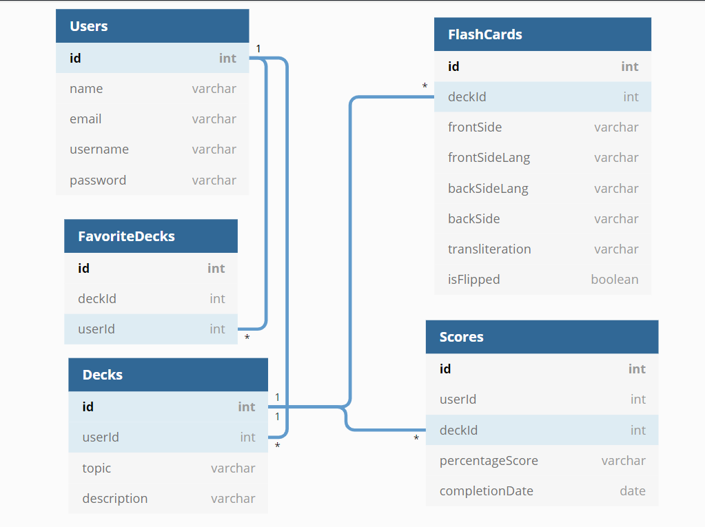
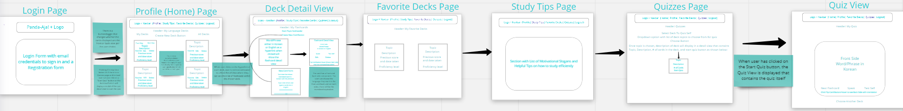
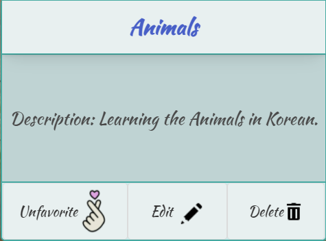
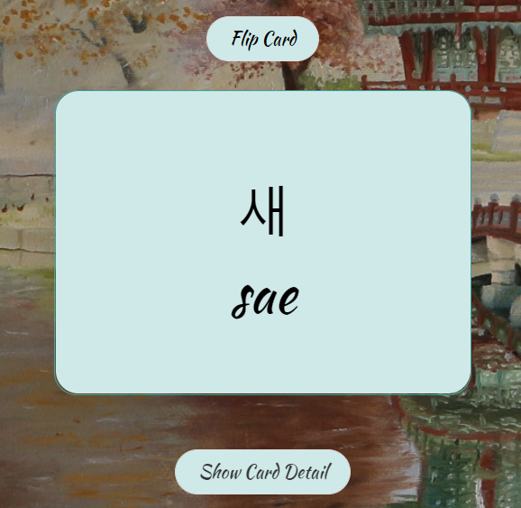
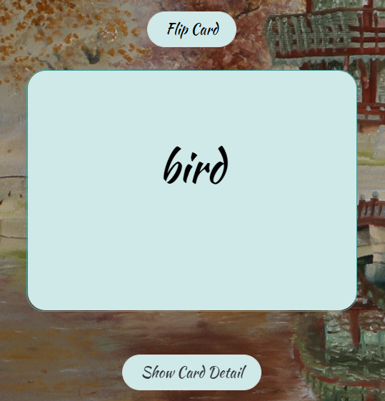
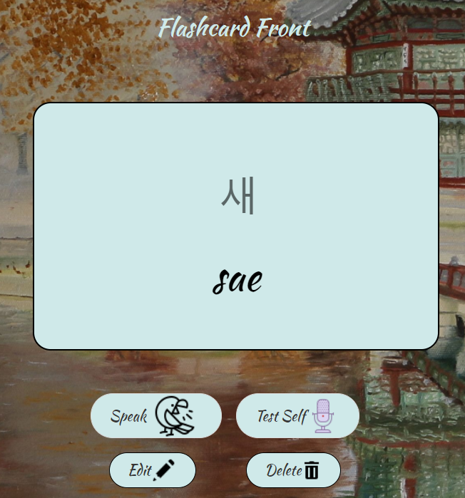
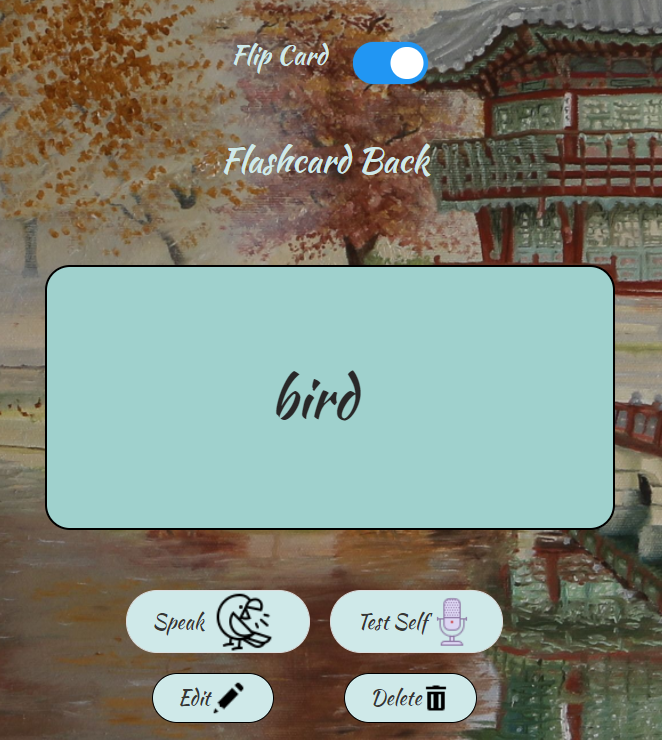
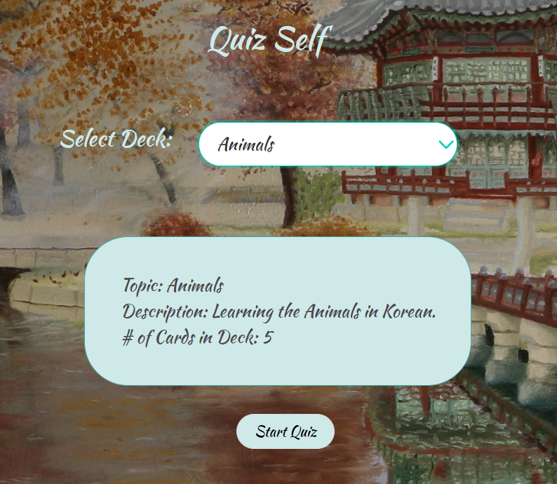
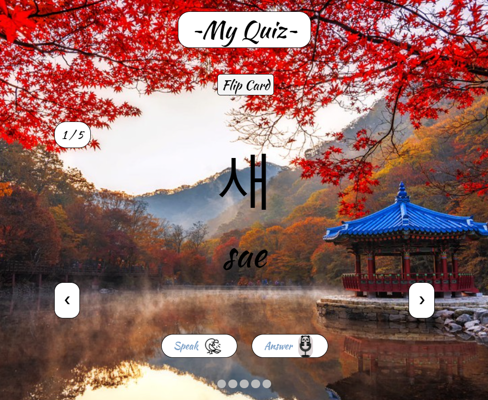
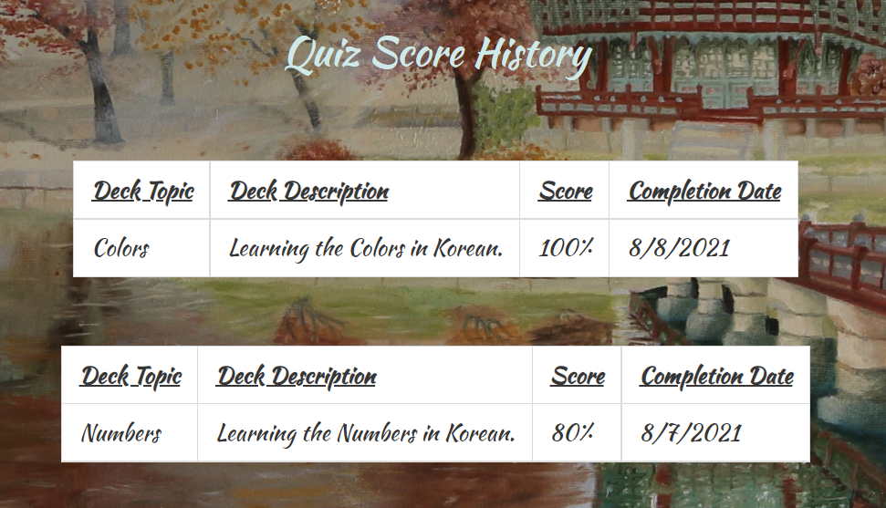

# Panda-Aja!


## Setup: Follow these steps exactly:

1. Use terminal to clone this repository
1. `cd` into the directory it creates
```
git clone git@github.com:luzm321/panda-aja.git
cd panda-aja
```
1. Create an `api` directory outside of the project directory.
1. In the `api` directory, create a copy of the `database.json.example` and remove the `.example` extension.
1. Run `json-server -p 8088 -w database.json` from the `api` directory.
1. Run `npm install` and wait for all dependencies to be installed.
1. Run `npm start` to verify that installation was successful.

> **Note:** Your `database.json` file is already in the `.gitignore` file for this project, so it will never be added to the repo or pushed to Github.

## Panda-Aja! Proxy Server:

1. Please go to this github repository link: https://github.com/luzm321/panda-aja-proxy-server to access the proxy server that needs to be ran and served along with the Panda-Aja! app and the JSON server database on separate ports in the terminal in order for the API fetch calls to work.
1. Use terminal to clone the proxy server repository: 
```
git clone git@github.com:luzm321/panda-aja-proxy-server.git
cd panda-aja-proxy-server
```

1. The proxy server should be served on port: localhost 3000 (type in terminal: node server.js -p 3000 -w).


## Inspiration for creating Panda-Aja!

I have been interested in South Korean culture for approximately 15 years with regard to Korean pop music, Korean cuisine, and Korean dramas/shows/movies. At times, it is cumbersome having to wait a while for a particular show/drama/movie/music to have english subtitles/translation before I can enjoy watching/listening to them. This has been the driving catalyst that inspired me to build a fun and innovative Korean language learning application that will solve this problem so that I (and others who may want to use my app for similar purposes) can better understand the language. Learning a new language can be difficult and I wanted to make a simple app that facilitates the process and journey of embarking on this feat in a way that makes the application user-friendly with regard to having a meaningful user experience and interface.


## What is Panda-Aja!?

**Note:** Meaning behind name: In certain cultures, Pandas can symbolize resilience, strength, luck, and they are adorable! Meanwhile, Aja! is a South Korean motivational chant of encouragement to oneself or others that signifies “You can do it!” because learning a new language can be challenging.


Panda-Aja! is a flashcard-based, Korean language learning application with a flipping system and mechanism that features an innovative and fun approach to learning the Korean language through meaningful and user-friendly interface. 
The app integrates various forms of user interaction by implementing speech and text functionality via Web Speech API for text-to-speech (speech synthesis) and speech-to-text (speech recognition).

The app is built with the ReactJS library and supplemented with the Web Speech API, Microsoft Translator Text external API, SweetAlert2 npm, and node fetch proxy server. Furthermore, Panda-Aja! is designed to be a CRUD app and is supported by a flat data-structure utilizing JSON Server along with being styled with Bulma framework and CSS.

This application is built for my Front-End/Client-Side Capstone project for Nashville Software School.

The following are examples of how the resources in your API should look once it is populated with data from the application.

**Note:** This version of Panda-Aja! has mock authentication and does not provide secure storage. Please do not store sensitive information in this database!

### users

```json
{
      "id": 1,
      "name": "Luz Angelique Madrazo",
      "username": "luzm321",
      "password": "panda",
      "email": "luz@madrazo.com"
    }
```

### decks

```json
{
      "id": 1,
      "topic": "Animals",
      "description": "Learning the Animals in Korean.",
      "userId": 1
    }
```

### flashCards

```json
{
      "id": 1,
      "userId": 1,
      "deckId": 1,
      "frontSide": "새",
      "frontSideLang": "ko",
      "backSideLang": "en",
      "backSide": "bird",
      "transliteration": "sae",
      "isFlipped": true
    }
```
### favoriteDecks

```json
{
      "id": 1,
      "userId": 1,
      "deckId": 1
    }
```

### Capstone ERD (Entity Relationship Diagram):

Link: https://dbdiagram.io/d/60ef769a4ed9be1c05cd30bd




### Capstone Wireframe:

Link: https://miro.com/app/board/o9J_l6-l4q4=/




### Deck View:




### Flashcard Front Side View:




### Flashcard Back Side View:




### Flashcard Front Side Detail View:




### Flashcard Back Side Detail View:




### Quiz Deck Selection Detail View:




### Quiz Modal View:




### Quiz Score History View:


